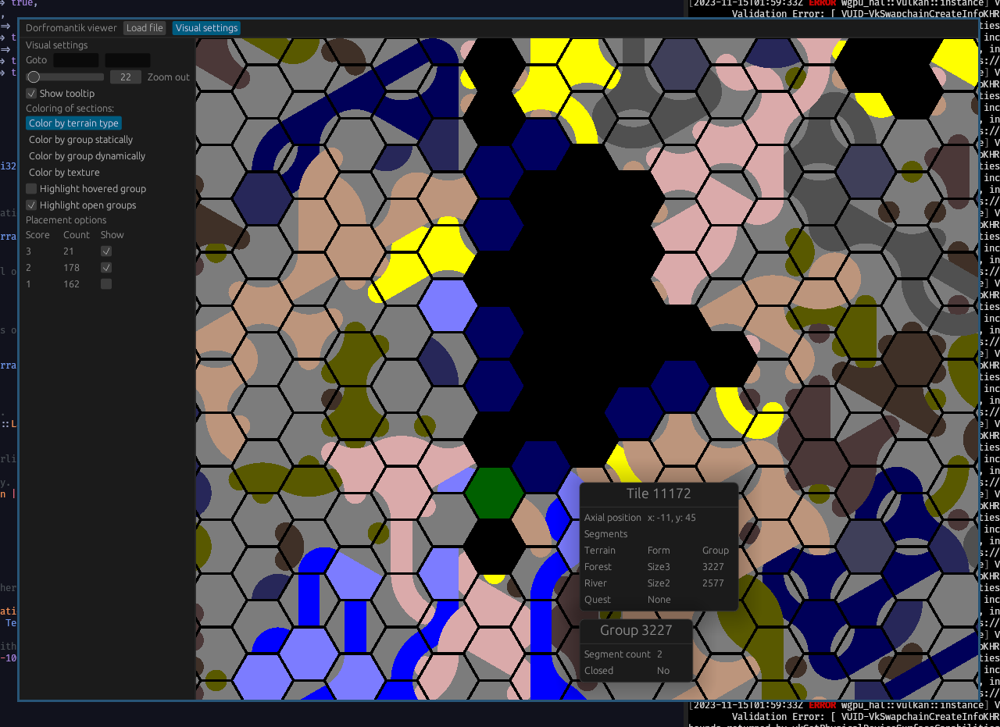

# About

Prototype for evaluating the use of egui in a future project.
Coincidentally, a dorfromantik solver, with savegame-load/watch ability.

## Savegame location on Arch
steamapps/compatdata/*/pfx/drive_c/users/steamuser/AppData/LocalLow/Toukana\ Interactive/Dorfromantik/Saves

# TODOs

- [x] Document TODOs
- [x] Fix lints
- [x] Fix readme :)
- [ ] Split run function
- [x] Add screenshot
- [ ] Incremental reload (nrbf is going to be fun....)
- [ ] Decode preplaced tiles (the coordinate conversion is going to be fun)
- [ ] Compute probabilities for all tiles
- [ ] Evaluate best placements based on probability
- [x] Fix goto in ui
- [x] Improve UI
- [ ] Fix tooltip that shows up when mouse is outside window
- [ ] Highlight big groups
- [ ] Lerp for goto
- [ ] Collapsible list view of groups
- [ ] Auto-retry when failing to load file
